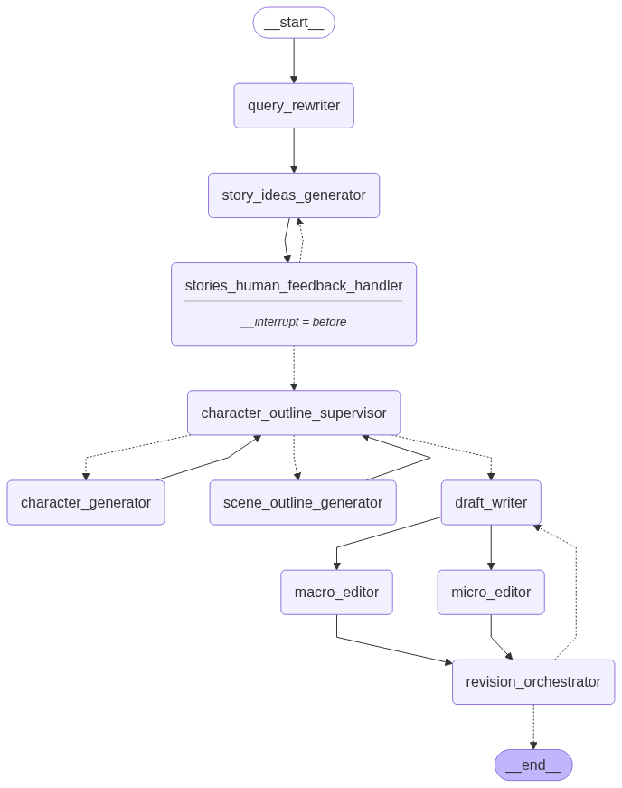

# LangGraph Creative Writer

This project demonstrates a creative‑writing agent built with [LangGraph](https://github.com/langchain-ai/langgraph) and Google Gemini.
The underlying graph strings together several LLM powered nodes so a story can evolve from an initial idea to a polished draft.

### Graph flow
1. **Query rewriter** – interprets the user prompt and expands it into a detailed description.
2. **Story ideas generator** – proposes multiple plot options.
3. **Human feedback handler** – lets you pick an idea or provide guidance, looping back for more ideas if needed.
4. **Character & scene generation** – creates casts and outlines while a supervisor node rates their quality.
5. **Draft writer** – produces a first draft from the approved outline.
6. **Macro & micro editors** – give structural and line‑level feedback.
7. **Revision orchestrator** – decides whether to loop back for another draft or finish the story.
=======
The graph coordinates multiple LLM driven nodes to iterate from a user query all
the way to a revised story draft.


## Architecture
- **ReAct style reasoning** powers decision making between nodes.
- **Human‑in‑the‑loop** feedback influences story ideas and outlines.
- A **Supervisor** node evaluates outlines before drafting.

The graph is rendered below and can also be explored in the
`writer.ipynb` notebook.



## Setup
1. Install Python 3.10+.
2. Install dependencies:
   ```bash
   pip install -e .
   ```
3. Set environment variables required by `langchain-google-genai` (e.g.
   `GOOGLE_API_KEY`). You can use a `.env` file which is loaded automatically.

## Running
Run the graph to compile and visualize it:

```bash
python graph.py
```

This will build the `StateGraph` and display the workflow image. From here you
can experiment by calling individual nodes or adapting the graph for your own
projects.

